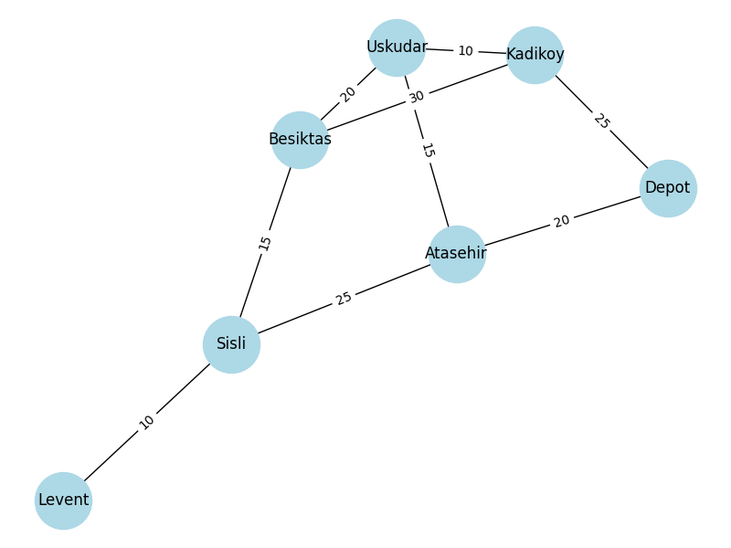

# E-commerce Delivery Network Optimization

## Problem Description
This project focuses on optimizing delivery routes for an e-commerce company operating in Istanbul. The goal is to minimize delivery time from the main depot to customer locations.

## Network Model
The network consists of 7 nodes representing different districts in Istanbul:

- Depot (main warehouse)
- Kadikoy
- Uskudar
- Besiktas
- Sisli
- Levent
- Atasehir

Edges represent travel time (in minutes) between locations.

## Methodology
The problem is modeled as a graph and solved using the Shortest Path algorithm provided by the NetworkX library in Python.

## Results
The shortest delivery path from Depot to Levent is:

Depot → Atasehir → Sisli → Levent

Total delivery time: 55 minutes

## Analysis
The results show that using Atasehir as an intermediate node significantly reduces delivery time compared to other routes.

## Visualization
The graph above shows the delivery network between different districts in Istanbul, with edge weights representing travel time in minutes.

## Technologies Used
- Python
- NetworkX
- Pandas
- Matplotlib
